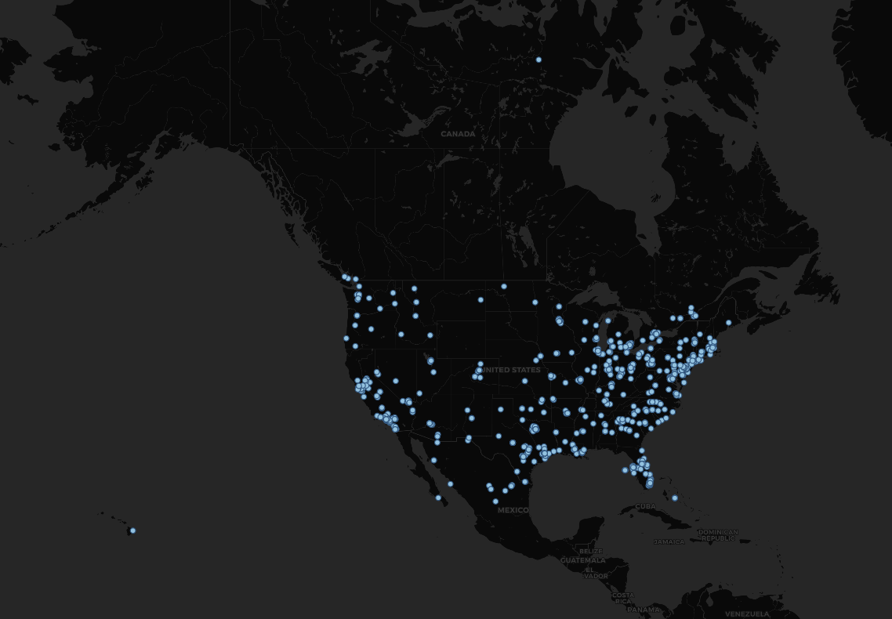

# Lab 2: Geo-tagged tweet collection and visualization
>*Unable to use Twitter API, so map is made using sample data from class. Below is proof of application for developer account.
*

### Image of Map

Geographic boundaries of the United States are used to harvest tweet data within a 60s window. Includes contiguous U.S. as well as Alaska and Hawaii.
